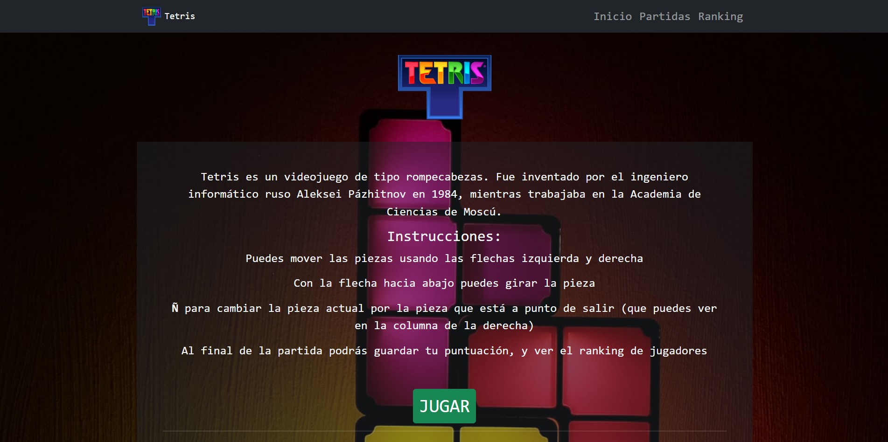
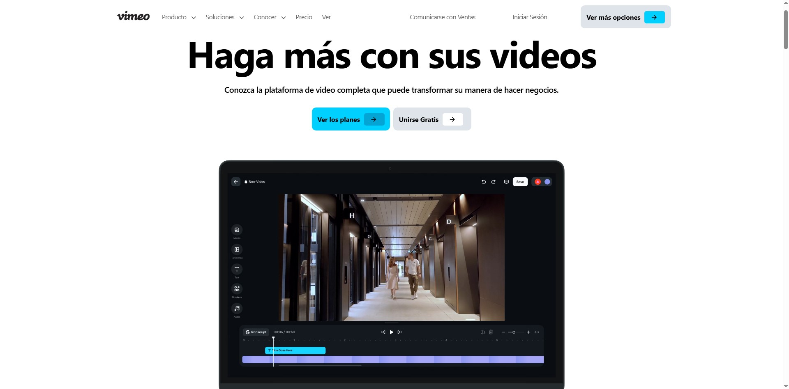
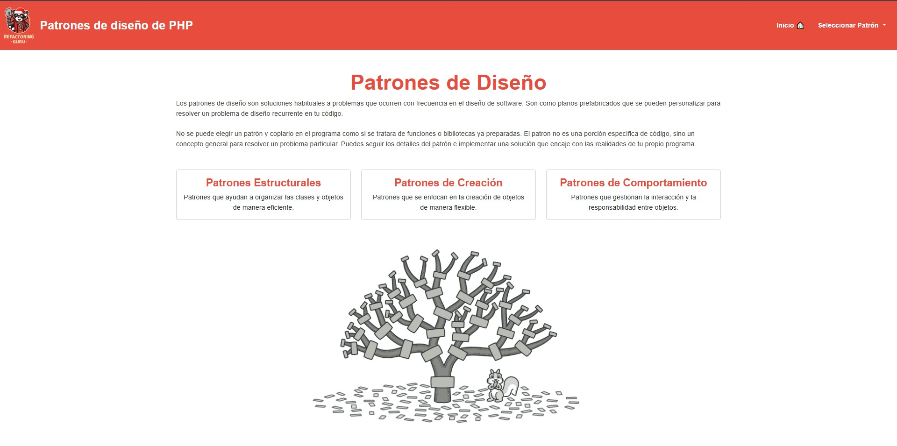

# Hi! I'm David!!  
Welcome to my Github!  
I'm **David Henrique**, from  **Caracas, Venezuela**, currently living in  **Barcelona, Spain**.  
I'm **19** years old, and I'm an amateur in programming and web design!!  

## I have knowledge in:

## 📌 About me !!  
- **Main Stack:** Bootstrap, HTML, React, and PHP.  
- **Experience in:** Frontend & Backend Development.  
- **What I like:** Design, videogames, anime, TV series, and drawing.  
- **Languages:** Spanish and a bit of English.  

---

# My Projects:

## 🎮 [Tetris Project](https://github.com/DavidHenrique24/proyectoTetris)  
📌 **Description:** A project based on the famous Tetris game.  
🛠 **Technologies:** JavaScript, CSS, Bootstrap, React & HTML.  
🔗 **Demo:** [View live](https://tetris-proyecto.vercel.app/)  

---

## 🛒 [Vimeo Project](https://github.com/DavidHenrique24/proyectoVimeo)  
📌 **Description:** A practice animation from the old Vimeo page.  
🛠 **Technologies:** Bootstrap, React, CSS & HTML.  
🔗 **Demo:** [View live](https://proyecto-vimeo-eb4e.vercel.app/)  

---

## 📊 [Design Patterns](https://github.com/DavidHenrique24/Patrones-de-Disenyo-DH)  
📌 **Description:** A practice to learn about design patterns with PHP.  
🛠 **Technologies:** PHP, HTML, Bootstrap & CSS.  
🔗 **Demo:** [View live](https://davesito4.alwaysdata.net/patrones-de-disenyo-php/index.php)  

---

## 📫 Contact  
📩 **Email:** [henriquemaciasdavidalejandro@fpllefia.com](mailto:henriquemaciasdavidalejandro@fpllefia.com)  
💼 **LinkedIn:** [David Henrique](https://www.linkedin.com/in/dave-sito-9519a3356/)  

⭐ Thank you so much for your attention! 😊  

